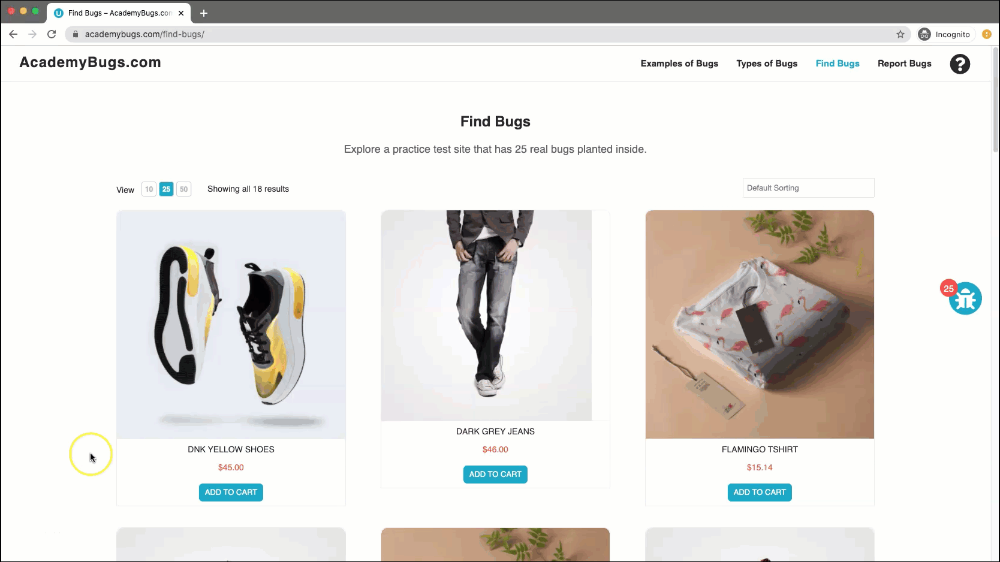
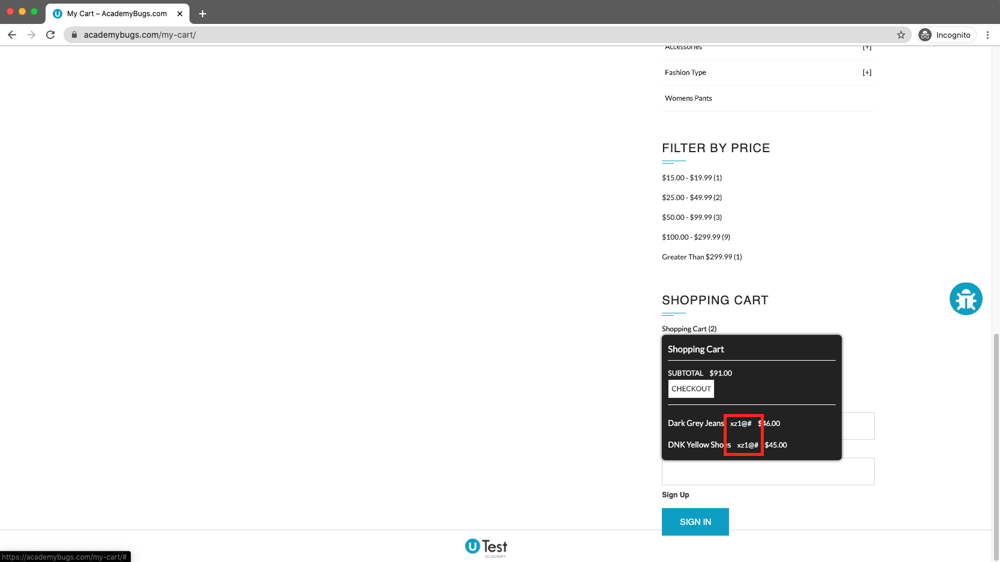

### Bug Report #005: Shopping Cart popup shows unexpected symbols

**Title**: Shopping Cart popup shows unexpected symbols
**Summary**: When the Shopping Cart popup in right panel is displayed, incorrect text is displayed
**Severity**: Minor

**Precondition**:

**Steps to Reproduce**:  
**Steps to Reproduce**:  
1. Go to https://academybugs.com/find-bugs/
2. Open a product page
3. Select 'Add to Cart'
4. Scroll down until 'SHOPPING CART' is visible in right column
5. Hover over 'Shopping Cart (#)' link

**Expected**: Popup displays cart preview as "[Product Name] x $xx.xx"
**Actual**: Popup displays cart preview as "[Product Name] x _xz1@#_ $xx.xx]"

**Notes**: 

